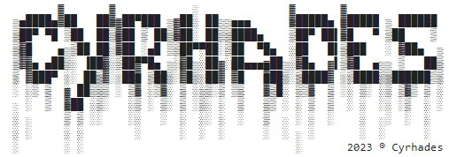

# CTF Stéganographie - Une image mais pas que

## Présentation du CTF 
**ID** 6 dans **les CTFs de Cyrhades**

La stéganographie est la pratique de dissimulation d'informations dans un autre message ou un objet physique pour éviter que celles-ci soient détectées. La stéganographie peut être utilisée pour cacher pratiquement tout type de contenu numérique, y compris du texte, des images, des vidéos ou du contenu audio.

Dans cet exercice l'image contient le flag arriverez vous à le trouver ?

## Aperçu

-----------

## Installation manuel
Vous n'utilisez pas l'application **les CTFs de Cyrhades** ? C'est dommage !
Mais voici comment télécharger ce CTF manuellement :

> git clone https://github.com/Hack-Oeil/STEGANO_EXERCICE_1.git

